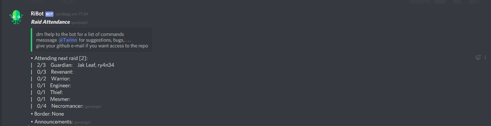

# Raid Bot

> Manage raid attendance within in discord channel. Configure the bot by sending it messages, all information for users in one channel.


## Getting Started

Place a copy of the provided data directory in the folder where you run RiBot.dll, and rename it to ```data``` (RiBot\bin\Debug\netcoreapp2.0\data). The same effect can be achieved by calling ```Config.Instance.Write()``` once, before you read the config.
If you want to add a new handler for a type of message, add the new type of message to  the ```CommandType``` enum. Then add the new handler  to the handlers list in the ```StartChannelHandler(ChannelConfig channelconfig)``` method in ```Bot.cs```. A handler inherits from IMessageHandler.

## Configuring data/general.json

The bot needs some information to run, like it's Discord Bot Key, and a key to use in a debug enviroment. You can get the key for a bot from an application you can create on the Discord developer portal. Put this information in data/general.json.
* *TestBotKey* - The key to use for a bot when the application runs in Debug mode
* *ReleaseBotKey* - The key to use for a bot when the application runs in Release mode

Example:
```{"TestBotKey":"aLongKey","ReleaseBotKey":"anotherKeyOfAboutTheSameSize"}```

## Deployment

Publish the RiBot project with the correct settings for the enviroment you want to run the bot in. Make sure that you are in Release configuration and that the correct bot key is set for release. Add your bot to a Guild Discord (with administrator rights) and whisper ```!addchanel + guildDiscordId``` to it. You can acquire the Id by right clicking on the Guild Discord with developement mode enabled. After that use ```!help``` in the created channel to get a list of commands. You edit all properties of the created channel.

## Built With

* [.NET Core 2.0](https://www.microsoft.com/net/download/dotnet-core/2.0) - The framework used
* [Discord.NET](https://github.com/RogueException/Discord.Net) - .NET library interface with the Discord API


## Authors

* **Robrecht Blancquaert** - *Tarinn* - Main author


## License

This project is licensed under the MIT License - see the [LICENSE.md](LICENSE.md) file for details

