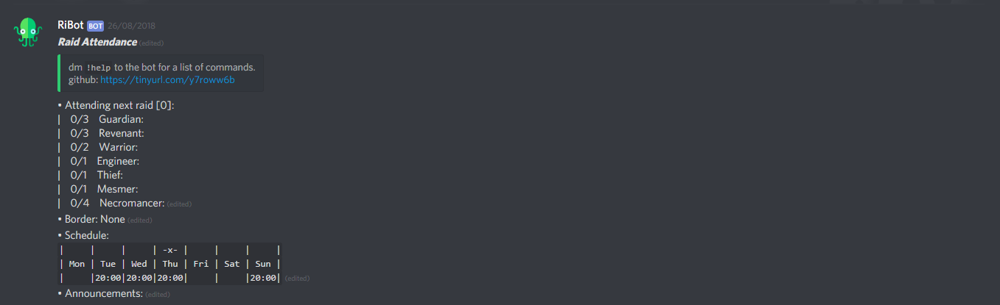

# Raid Bot

> Manage raid attendance within in discord channel. Configure the bot by sending it messages, all information for users in one channel.


## Getting Started

The application uses a test bot client for debug purposes. If you want to change the release or test bot client, change the value of the key in 'Client.LoginAsync(TokenType.Bot, key) in the run() method of Bot.cs to the key of your bot. If you want to add a new handler for a type of message, add the new type of message to  the CommandType enum. Then add the new handler  to the handlers list in the StartChannelHandler(ChannelConfig channelconfig) method in Bot.cs. A handler inherits from IMessageHandler.

## Configuring config.json

The bot needs some information to run, like it's Discord Bot Key and the id of an authorised user on Discord to work. You can get the key for a bot from an application you can create on the Discord developer portal. The id of an authorised user is obtainable via right clicking on a user in Discord, with developer mode enabled. Copy the config.json to where your application will run (for example: RiBot/bin/Debug/netcoreapp2.0/config.json) and fill in the required values in the file itself.
* *TestBotKey* - The key to use for a bot when the application runs in Debug mode
* *ReleaseBotKey* - The key to use for a bot when the application runs in Release mode
* *AuthUserIds* - An array of intigers that represent all authorised users

Example:
```{"TestBotKey":"aLongKey","ReleaseBotKey":"anotherKeyOfAboutTheSameSize","AuthUsersIds":[10101010]}```

## Deployment

Publish the RiBot project with the correct settings for the application you want to run the bot on. Make sure that you ar ein Release configuration and that the correct bot key is set for release. The bot also needs a config.json to be present with at least 1 authorised user and the Discord bot key for release, so copy the config.json in the git root to where you deploy the bot and set the right value for AuthUserIds and ReleaseBotKey inside of it.

## Built With

* [.NET Core 2.0](https://www.microsoft.com/net/download/dotnet-core/2.0) - The framework used
* [Discord.NET](https://github.com/RogueException/Discord.Net) - .NET library interface with the Discord API


## Authors

* **Robrecht Blancquaert** - *Tarinn* - Main author


## License

This project is licensed under the MIT License - see the [LICENSE.md](LICENSE.md) file for details

